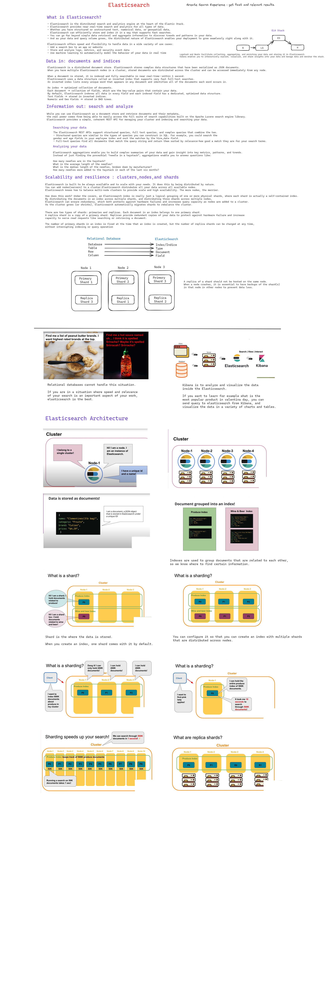
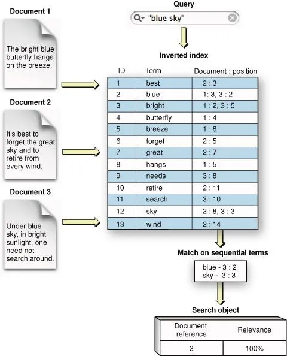

<<<<<<< HEAD

=======


## Full Text Search
<p align="center">
    
</p>

## Elasticsearch Query Types

<details>
<summary>Match Query</summary>
Returns documents that match a provided text, number, date or boolean value. The provided text is analyzed before matching.

The match query is the standard query for performing a full-text search, including options for fuzzy matching.
</details>

<details>
<summary>Term Query</summary>
Returns documents that contain an exact term in a provided field.
You can use the term query to find documents based on a precise value such as a price, a product ID, or a username.
</details>

<details>
<summary>Bool Query</summary>
A query that matches documents matching boolean combinations of other queries.
The bool query maps to Lucene BooleanQuery. It is built using one or more boolean clauses, each clause with a typed occurrence. The occurrence types are:
    
must
The clause (query) must appear in matching documents and will contribute to the score.
    
filter
The clause (query) must appear in matching documents. However unlike must the score of the query will be ignored. Filter clauses are executed in filter context, meaning that scoring is ignored and clauses are considered for caching.
    
should
The clause (query) should appear in the matching document.
    
must_not
The clause (query) must not appear in the matching documents. Clauses are executed in filter context meaning that scoring is ignored and clauses are considered for caching. Because scoring is ignored, a score of 0 for all documents is returned.
</details>

<details>
<summary>Range Query</summary>
Returns documents that contain terms within a provided range
</details>

<details>
<summary>Fuzzy Query</summary>
Returns documents that contain terms similar to the search term, as measured by a Levenshtein edit distance.

An edit distance is the number of one-character changes needed to turn one term into another. These changes can include:

Changing a character (box → fox)
Removing a character (black → lack)
Inserting a character (sic → sick)
Transposing two adjacent characters (act → cat)
To find similar terms, the fuzzy query creates a set of all possible variations, or expansions, of the search term within a specified edit distance. The query then returns exact matches for each expansion.
</details>

<details>
<summary>Wildcard Query</summary>
Returns documents that contain terms matching a wildcard pattern.
    
A wildcard operator is a placeholder that matches one or more characters. For example, the * wildcard operator matches zero or more characters. You can combine wildcard operators with other characters to create a wildcard pattern.
</details>

<details>
<summary>Prefix Query</summary>
Returns documents that contain a specific prefix in a provided field.
</details>


## Getting information about cluster and nodes
Syntax: 
```
GET _API/parameter
```
### Get info about cluster health
```
GET _cluster/health
```

### Get info about nodes in a cluster
```
GET _nodes/stats
```

## Performing CRUD operations

## C - Create
### Create an index
Syntax:
```
PUT Name-of-the-Index
```
Example:
```
PUT favorite_candy
```


#### Index a document
When indexing a document, both HTTP verbs `POST` or `PUT` can be used. 

1) Use POST when you want Elasticsearch to autogenerate an id for your document. 

Syntax:
```
POST Name-of-the-Index/_doc
{
  "field": "value"
}
````
Example:
```
POST favorite_candy/_doc
{
  "first_name": "Lisa",
  "candy": "Sour Skittles"
}
```


2) Use PUT when you want to assign a specific id to your document(i.e. if your document has a natural identifier - purchase order number, patient id, & etc).
For more detailed explanation, check out this [documentation](https://www.elastic.co/guide/en/elasticsearch/guide/current/index-doc.html) from Elastic! 

Syntax:
```
PUT Name-of-the-Index/_doc/id-you-want-to-assign-to-this-document
{
  "field": "value"
}
```
Example:
```
PUT favorite_candy/_doc/1
{
  "first_name": "John",
  "candy": "Starburst"
}
```
### _create Endpoint
When you index a document using an id that already exists, the existing document is overwritten by the new document. 
If you do not want a existing document to be overwritten, you can use the _create endpoint! 

With the _create Endpoint, no indexing will occur and you will get a 409 error message. 

Syntax:
```
PUT Name-of-the-Index/_create/id-you-want-to-assign-to-this-document
{
  "field": "value"
}
```
Example:
```
PUT favorite_candy/_create/1
{
  "first_name": "Finn",
  "candy": "Jolly Ranchers"
}
```


## R - READ
### Read a document 
Syntax:
```
GET Name-of-the-Index/_doc/id-of-the-document-you-want-to-retrieve
```
Example:
```
GET favorite_candy/_doc/1
```

## U - UPDATE
### Update a document

If you want to update fields in a document, use the following syntax:
```
POST Name-of-the-Index/_update/id-of-the-document-you-want-to-update
{
  "doc": {
    "field1": "value",
    "field2": "value",
  }
} 
```
Example:
```
POST favorite_candy/_update/1
{
  "doc": {
    "candy": "M&M's"
  }
}
```

## D- DELETE
### Delete a document

Syntax:
```
DELETE Name-of-the-Index/_doc/id-of-the-document-you-want-to-delete
```
Example:
```
DELETE favorite_candy/_doc/1
```

## REFERENCES
# https://www.elastic.co/guide/en/elasticsearch/reference/current/elasticsearch-intro.html
# https://github.com/LisaHJung
>>>>>>> 60e3dc67621e3f8e660d43834ef2cdfe1ff23c39
